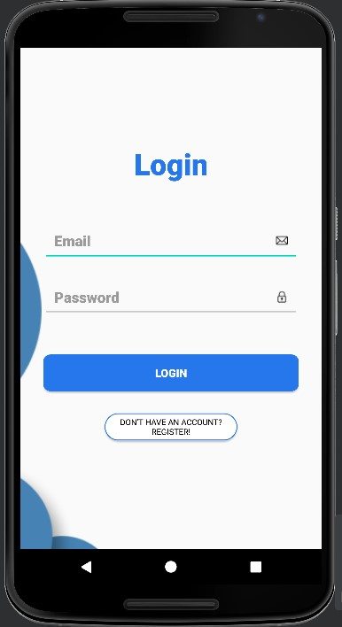
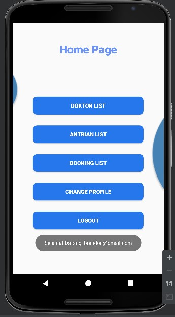
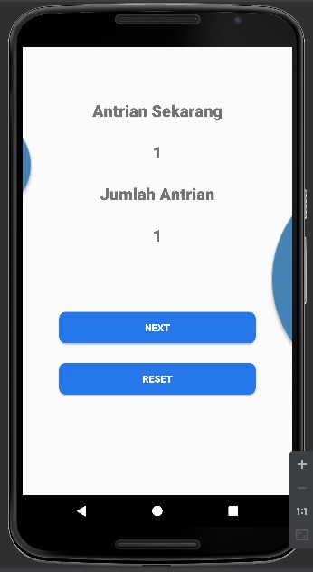

<h1 align="center">
  HospitalQ App
</h1>

<i> !!This app created using android studio and java languange</i>
An android application that is used for registration and tracking of queue numbers, so that hospital visitors do not have to queue for too long and reduce crowds at the hospital. With this application, it is hoped that it can reduce the spread of the COVID-19 virus. This application use HTTP API from NodeJS, ExpressJS, and MongoDB stack.

### Poster of this app

  

### Flowchart
Admin Flowchart

  

Doctor Flowchart

  

Patient Flowchart

  

#

## How to make node device

### Features
- Shared Preferences
- Camera Features
- Get and send data with HTTP API
- Register and login user
- 3 user role (admin, doctor, and patient)
- Booking doctor by patient
- See tracting number
- Doctor can control queue numbers

### Libraries
- Retrofit
- Reactivex RXjava

#

## How to reverse engineering this app?
For demo purpuse you can install the APK file above, and for API you can access it from https://hospitaq-api.herokuapp.com/
- username: admin, password: admin --> for admin demo
- username: doktor2@gmail, password: doktor2 --> for doctor demo
- username: mobileprog@gmail.com, password: mobileprog --> for patient demo

if you want change this app to your needs:
- Install android studio
- Clone this repository
- For API server, in "HospitalQ API" folder run npm install and npm run.
- API server will be run in localhost:3000
- Import "HostpitalQ App" in android studio
- sync graddle
- Configure API url in java/id.ac.umn.hospitalq/retrofit/RetrofitClient.java
- And happy reverse engineering this app!

#

## App Preview

  
  
  

For full preview, please go Image folder

#

## <i>If need help, feel free to contact me!</i>